Conclave
========

The year is 1492. You are a cardinal. You would rather be Pope. Unfortunately, several other cardinals also want to be Pope. You must convince them to vote for you, or failing that, at least sell your vote for a good amount of wealth and power.

Rules
=====

The object of the game is to have the most victory points when the Pope is elected. You gain victory points by ruling territory, building magnificent buildings, accumulating wealth, gaining the favor of the Pope, and of course, becoming Pope yourself.

Setup
-----

Cards marked "5+" are only used if there are five or more players; cards marked "6+" are only used if there are six or more players, and cards marked "7+" are only used if there are seven players.

Each player selects one cardinal to play as. They take that cardinal's vote card, identity card, and papal favours (marked with that cardinal's coat of arms). Each player places their identity card face-up in front of themself.

Deal each player one Ambition card face-down. Players may look at their Ambition, but may not trade it.

If there are four or six players, add the Maffeo Gherardi vote card to the center of the table.

Shuffle the Wealth cards (all remaining cards are Wealth cards) and deal cards equal to the number of players face-up in the middle of the table. If any Mercenary cards are dealt, shuffle them back into the deck and replace them. These cards are the spoils of war.

Deal all remaining Wealth cards to the players (12 cards each).

Gameplay
--------

Players trade their wealth cards, papal favors, and votes with one another. All trading is simultaneous, and can occur in any order. Trades do not have to be one-for-one: you can trade one card for two, or three for four, etc. Players can trade cards, including votes, that they receive from other players.

If there are four or six players, players may exchange Gold cards with value totaling at least 9000 Ducats for the vote of Maffeo Gherardi. The gold is removed from play.

Apart from the above, players cannot play cards until the end of the game; all cards remain in the players' hands.

Card types
----------

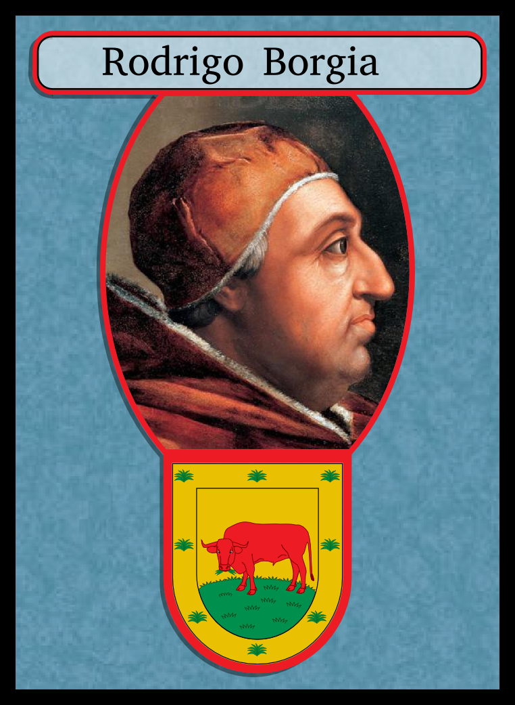

*Vote*: You need votes to become Pope.

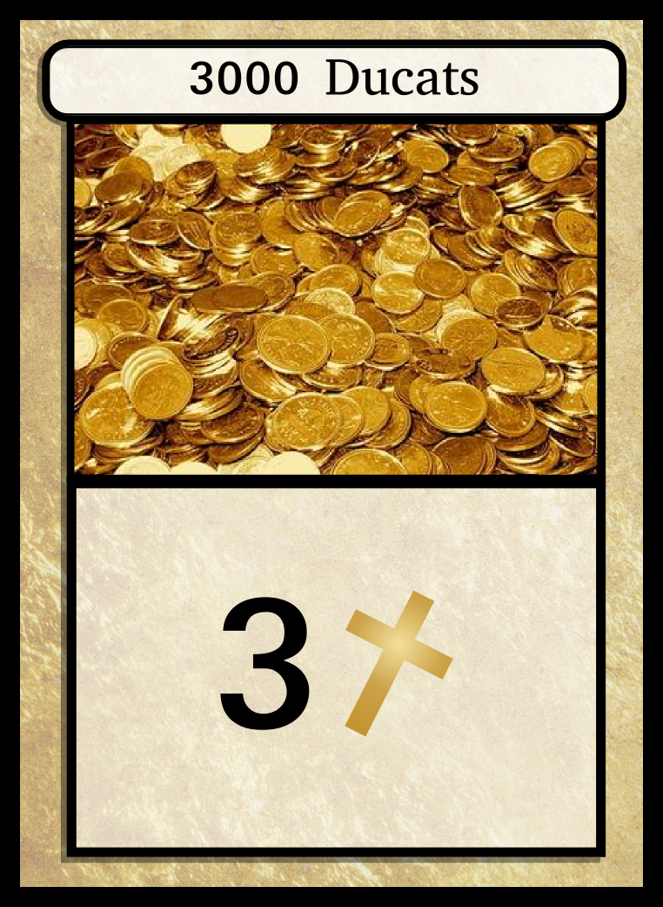

*Gold*: Gold cards are worth points.

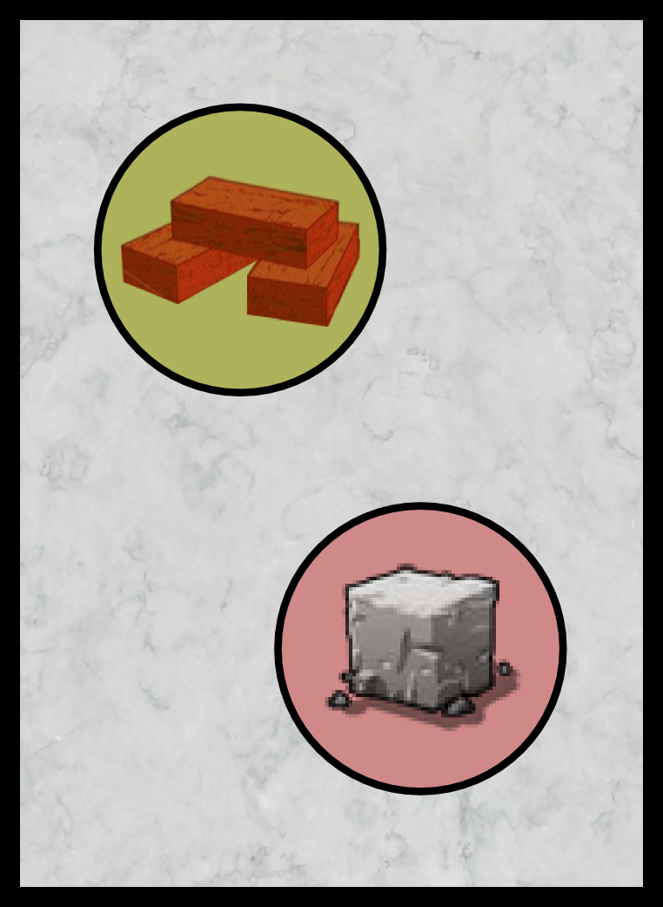

*Resources*: Resources are used to build buildings. 

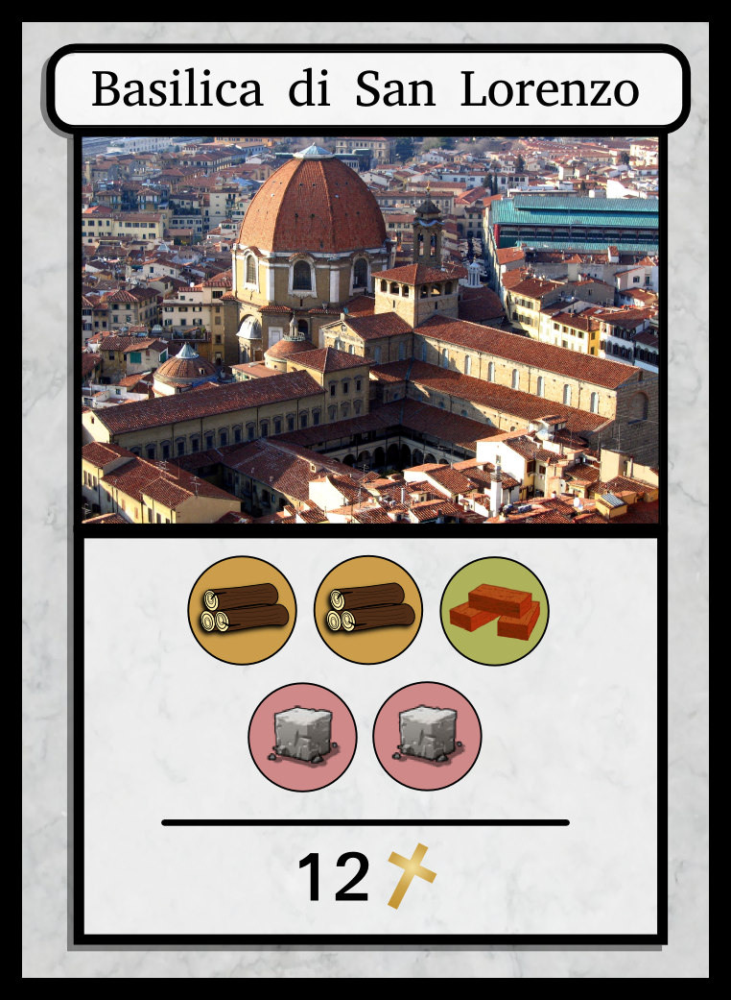

*Buildings*: Buildings are worth points only if you have resources sufficient to build them. For example, to build the Basilica di San Lorenzo, you need resource cards totaling two wood, one brick, and two stone. If you have these resources and the building card, you score 12 points. The resources used to build one building cannot be used to build another, but if you use only some of the resources on a resource card to build one building, you can use the remaining resources to build another.

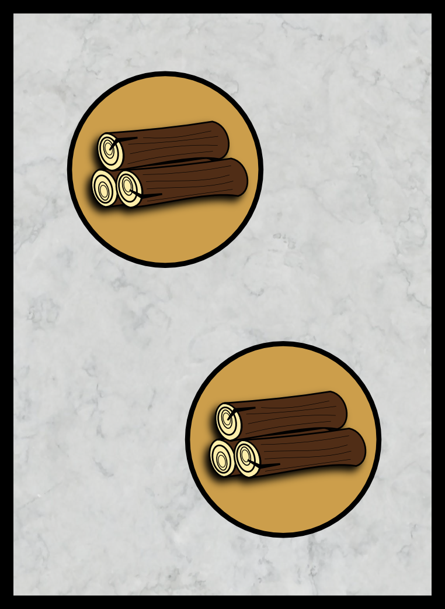

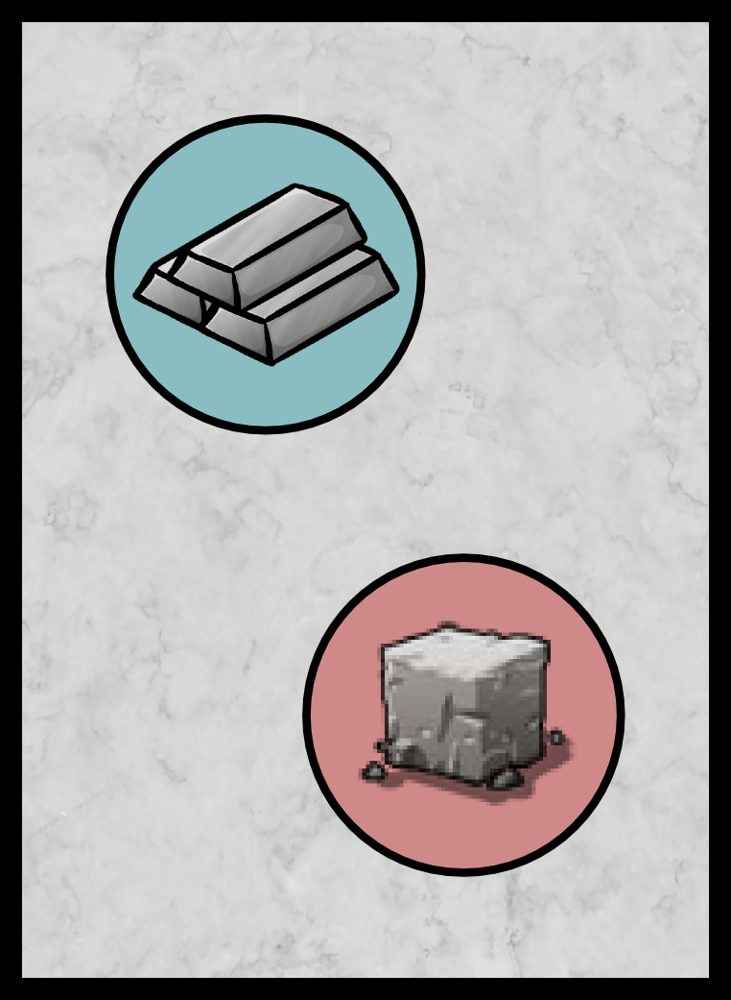

In this example, the player can build the Basilica di San Lorenzo, with one Iron left over which can be used for another building.

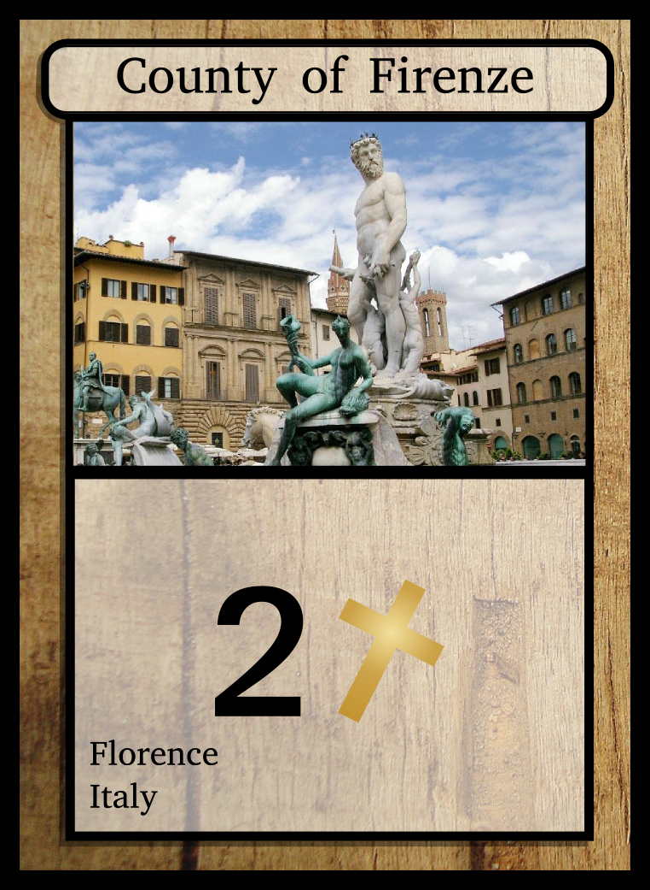
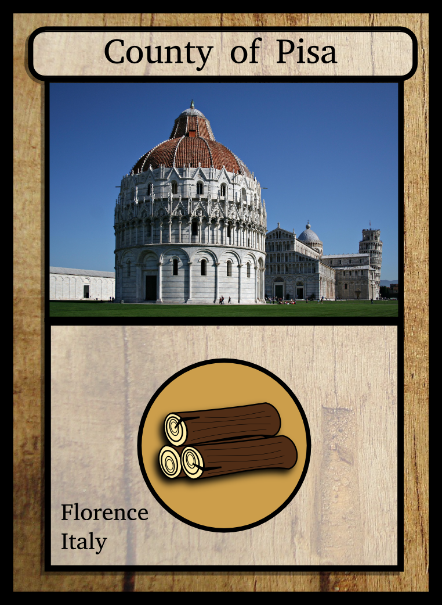
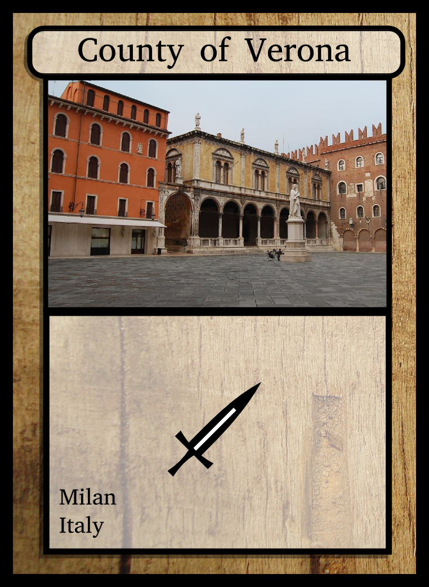

*Counties*: Counties are worth points, or produce resources, or contribute to your military. A resource present on a county is equivalent to a resource present on a resource card.

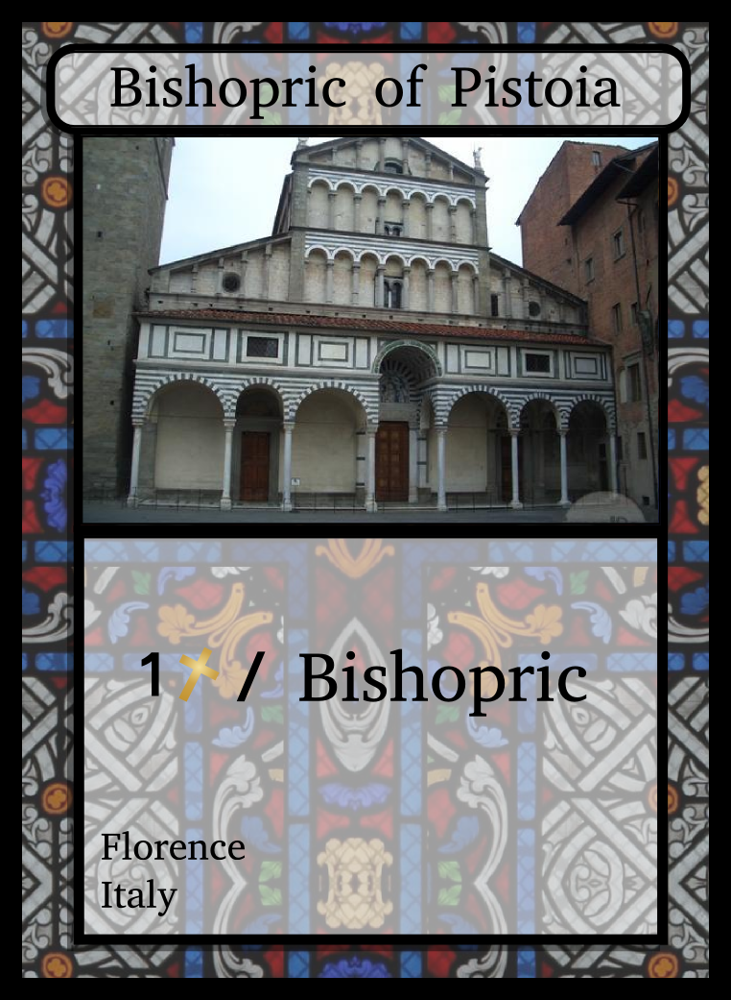

*Bishoprics*: Each bishopric is worth one point for each bishopric you have. One bishopric is worth one point, two bishoprics are worth two each (for a total of four), etc.

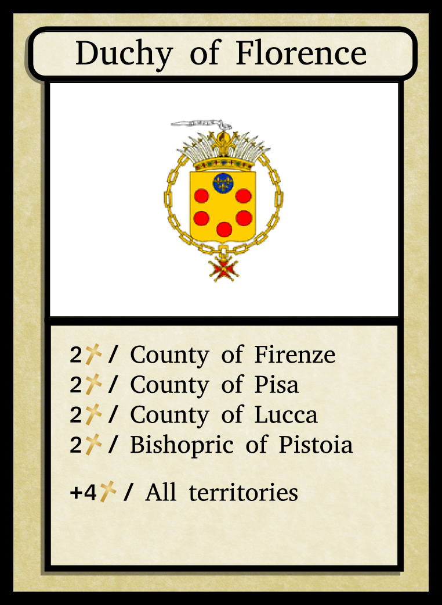

*Duchies*: A duchy scores points if you have counties and bishoprics located in that duchy. For example, if you had the Duchy of Florence and the counties of Firenze and Lucca, the duchy would be worth four points. If you had the duchy, all three counties, and the bishopric, the duchy would be worth 12 points (and the counties and bishopric would be worth additional points).

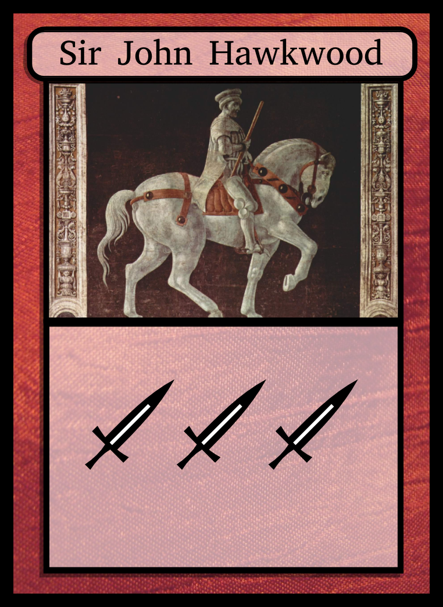

*Mercenaries*: At the end of the game, the player with the strongest army (the most total swords, including from counties) gets to take their choice of card from the spoils of war. Then, the player with the second strongest army takes a card, and so on. However, the player with the weakest army does not get any spoils, instead the player with the strongest army takes the last remaining card. If there is a tie, the Pope wins the tie, or if neither player is the Pope, the player nearest the Pope in clockwise order wins the tie.

*Papal favours*: Papal favours are only worth points if they are traded away and the giver of the favor is elected Pope. For example, if at the end of the game Sforza has two 5-point favours from Borgia and one from Carafa, Borgia has one of his own favours, and Borgia is elected Pope, Sforza scores 10 points (from Borgia's favors, but not Carafa's), and Borgia scores no points (because he cannot use his own favours).

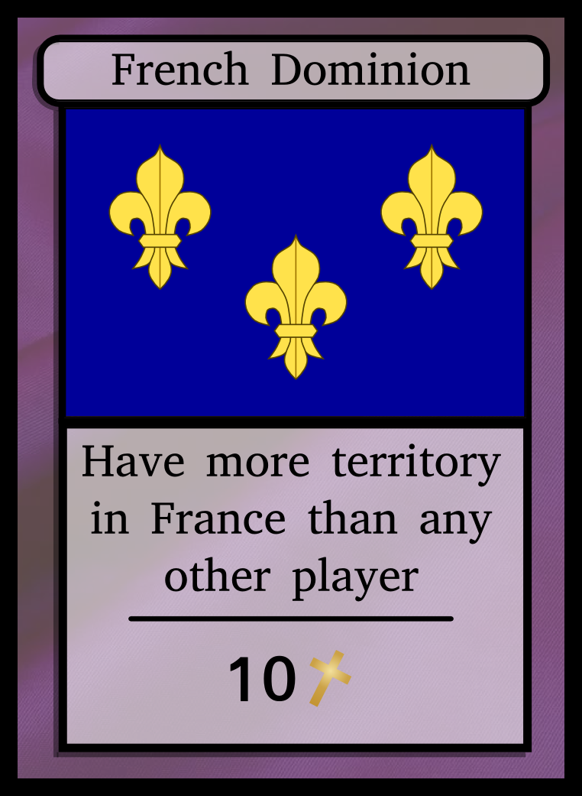

*Ambitions*: Ambitions are worth ten points if the player can fulfill their conditions. For example, to score French Dominion, the player must have the most counties and bishoprics in France (i.e. with France shown in the lower-left). Ambitions cannot be traded.

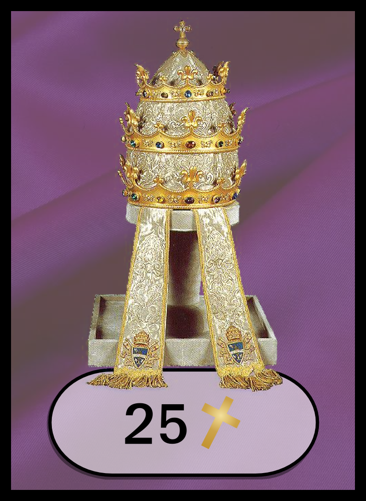

*The Papacy*: The papacy is worth 25 points.

Game End
--------

Once one player has accumulated three or more votes (four in a six- or seven-player game), that player may declare themself Pope and take the Pope card. Each other player may finish their current trade, then trading ends. The spoils of war are divided, then scores are totaled, starting with the Pope and proceeding clockwise. The player with the highest score is declared the winner.

Game Assembly
=============

Pages of cards ready for printing can be found in the pages/ folder, individual cards can be found in the cards/ folder.

The cards fit in a standard Magic-sized card sleeve; placing a paper printout of a card in front of a Magic card in a sleeve is an easy way to assemble the game.

Identity cards (which look identical to votes), ambitions, the Pope card, and the Maffeo Gherardi card should all be placed in different-colored sleeves to the rest of the cards.

If you want to modify any of the cards, the create\_pages.py script can construct pages with the modified cards. Simply run "python create\_pages.py cards/AAA.svg cards/BBB.svg", where AAA and BBB are the names of the modified cards. You'll need the Envoy library as well as the ImageMagick and Inkscape packages. The script has only been tested on Linux.
